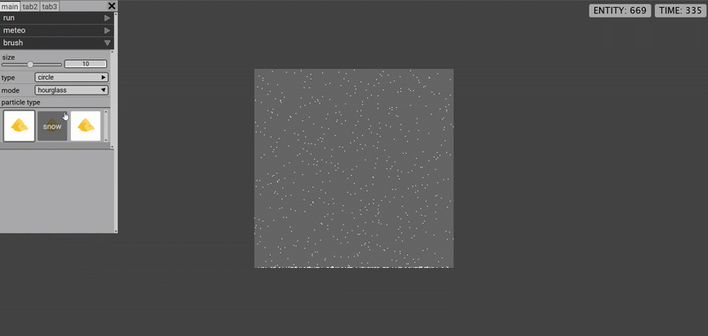

## Link
https://matteopalazzolo.altervista.org/portfolio/simulation/

## Intro
- data: 4 Apr 2021
- da solo in 3° liceo (A.S. 2020/2021)
- app web vanilla
- utilizza procedural-gui.js, un tentativo abbastanza atroce di creare una GUI procedurale usando solo JS in un'app web vanilla. (all'epoca non avevo idea di cosa fosse php, un framework o una richiesta GET)

---

[full video](./screenshots/00.mp4)